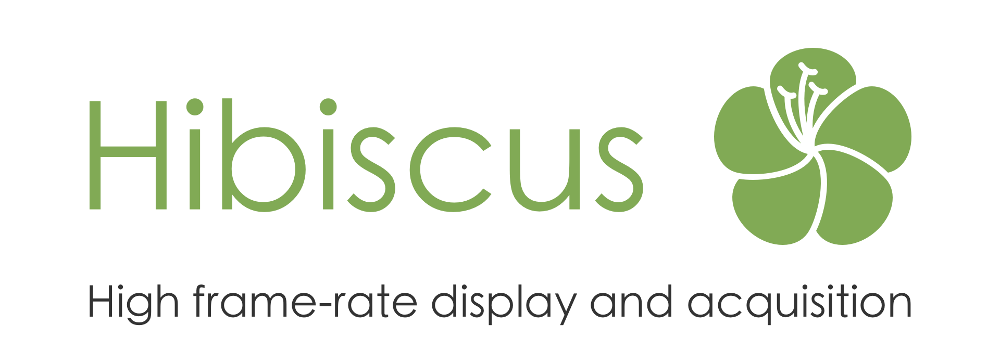

Hibiscus bundles tools to build a complete psychophysics platform on top of hummingbird. It is meant for a Jetson TX1 and a Teensy 3.5.

# connect to the Jetson

1. Set up your ethernet configuration as follows:
  - IP address: `20.20.20.100`
  - Mask: `255.255.255.0`
  - Gateway: leave blank

2. Run the command:
```
ssh nvidia@20.20.20.99
```
The password is `nvidia`.

If you are connected to the same WiFi network as the Jetson, you can use it as well.

# network overview

Once everything is set up, the system will have the following network configuration.

__WiFi__: The Jetson's WiFi uses the default configuration, and is used to connect to the internet for updates, git clones... The *System Settings app* can be used to connect to new networks.
- Typical network: `192.168.1.*`
- Jetson IP address: given by the WiFi router.

__Ethernet__: The Jetson's ethernet port is used to communicate with other computers during experiments.
- Network: `20.20.20.*` (mask `255.255.255.0`)
- Jetson IP address: `20.20.20.99`
- Network configuration for the experimentalist:
  - IP address: `20.20.20.100`
  - Mask: `255.255.255.0`

__LightCrafter__: The LightCrafter manages a pseudo-network when connected to the Jetson through USB. The default IP must be changed to avoid conflicts with the WiFi network.
- Network: `10.10.10.*` (mask `255.255.255.0`)
- Jetson IP address: `10.10.10.99`
- LightCrafter IP address: `10.10.10.100`

# user guide

## scripts

### do_block.py

`do_block.py` runs the `calibrate` and `record` programs.

```sh
cd /path/to/hummingbird
python3 scripts/do_block.py [options] /path/to/parameters.py
```
Available options:
- `-f`, `--force` overwrites the output file if they exist.
- `-s`, `--skip-calibration` skips the calibration and only records. The calibration file must have been generated beforehand.
- `-g`, `--gpu-message` does not hide the GPU messages.
- `-h`, `--help` shows the help message.

The programs `calibrate` and `record` must be compiled before using the script. Instructions are given by the [programs](#programs) section.

`/path/to/parameters.py` must have the following structure:
```json
{
    "calibration": "/path/to/calibration.json",
    "clips": ["/path/to/first/clip.mp4", "/path/to/second/clip.mp4"],
    "output": "/path/to/output.es",
    "before_fixation_duration": 1200,
    "fixation_duration": 1100,
    "after_fixation_duration": 200,
    "points": [
        [ 34,  34],
        [171,  34],
        [308,  34],
        [ 34, 171],
        [171, 171],
        [308, 171],
        [ 34, 308],
        [171, 308],
        [308, 308]
    ],
    "pattern": [,
        "   #   ",
        "   #   ",
        "   #   ",
        "#######",
        "   #   ",
        "   #   ",
        "   #   "
    ]
}
```

- `"calibration"` is the path to the output calibration file. If this path is not absolute, it is resolved relatively to `/path/to/parameters.py`. If this file already exists, the program stops unless the flag `--force` is added to the arguments.

- `"clips"` is a list of video clip paths. Each non-absolute path in this list is resolved relatively to `/path/to/parameters.py`. The list cannot be empty, but has otherwise no length restriction.

- `"output"` is the path to the output Event Stream file. If this path is not absolute, it is resolved relatively to `/path/to/parameters.py`. If this file already exists, the program stops unless the flag `--force` is added to the arguments.

See [calibrate](#calibrate) for details on the optional parameters `"before_fixation_duration"`, `"fixation_duration"`, `"after_fixation_duration"`, `"points"` and `"pattern"`.

### read_es.py

`read_es.py` reads the binary output of the `record` program (see below) and prints a text-based representation of the data.

```sh
cd /path/to/hummingbird
python3 scripts/read_es.py [options] /path/to/record/output.es
```
Available options:
- `-h`, `--help` shows the help message.

This script requires the python module `eventstream`. Install instructions are available at [https://github.com/neuromorphic-paris/utilities#python](https://github.com/neuromorphic-paris/utilities#python).

## programs

### calibrate

`calibrate` estimates the parameters of the Livetrack to DMD 4 x 4 calibration matrix.
```sh
cd /path/to/hummingbird
./build/release/calibrate [options] output.json
```
Available options:
- `-p parameters.json`, `--parameters parameters.json` sets the calibration parameters. If the parameter is option is not passed, the parameters default to the equivalent *parameters.json* file content:
  ```json
  {
      "before_fixation_duration": 1200,
      "fixation_duration": 1100,
      "after_fixation_duration": 200,
      "points": [
          [ 34,  34],
          [171,  34],
          [308,  34],
          [ 34, 171],
          [171, 171],
          [308, 171],
          [ 34, 308],
          [171, 308],
          [308, 308]
      ],
      "pattern": [
          "   #   ",
          "   #   ",
          "   #   ",
          "#######",
          "   #   ",
          "   #   ",
          "   #   "
      ]
  }
  ```
  Only fields different from the defaults need to be specified. The durations are expressed in milliseconds. There must be at least four points (results are more accurate with more points. The pattern must have an odd number of rows and columns, and must contain only `'#'` and `' '` characters (representing on and off pixels, respectively).
- `-i [ip]`, `--ip [ip]` sets the LightCrafter IP address (defaults to `"10.10.10.100"`).
- `-f`, `--force` overwrites the output file if it exists.
- `-h`, `--help` shows the help message.

The generated `output.json` file has the following structure:
```json
{
    "points": [
        [ 34,  34],
        [171,  34],
        [308,  34],
        [ 34, 171],
        [171, 171],
        [308, 171],
        [ 34, 308],
        [171, 308],
        [308, 308]
    ],
    "left": {
        "matrix": [
            -0.000500992,   0.00269572, -0.00103148,  274.081,
             -0.00058359,  -0.00140402,  0.00189917,  212.388,
             5.27852e-19, -8.10961e-19, 1.06127e-18, 0.273093,
             3.89546e-07,  7.84538e-07, 2.16504e-07, 0.458227
        ],
        "reprojection_errors": [
            3.63763,
            4.67781,
            9.13678,
             6.2297,
            9.15647,
            7.30571,
            8.89996,
            9.15647,
            9.15507
        ]
    },
    "right": {
        "matrix": [
             0.00021368,   0.00266984, -0.000797397,   292.963,
            -0.00191981, -0.000169172,  4.59669e-05,   10.0208,
            4.17353e-08,  3.80498e-08,  -4.9549e-06, -0.476671,
            6.41801e-08, -1.92392e-07,   1.7655e-08,  0.396832
        ],
        "reprojection_errors": [
            5.35004,
            3.27579,
            5.49818,
            2.27209,
             4.0961,
            2.70487,
            5.49482,
            5.49901,
            5.49899
        ]
    }
}
```
The reprojection errors are expressed in screen pixels.

### record

`record` plays a list of stimuli and records precise timings.
```sh
cd /path/to/hummingbird
./record [options] /path/to/calibration.json /path/to/first/clip.mp4 [/path/to/second/clip.mp4...] output.es
```
Available options:
- `-f`, `--force` overwrites the output file if it exists.
- `-d`, `--duration` sets the inhibition duration in microseconds (defaults to `500000`). Button pushes during this duration after a video start are not accounted for.
- `-b [frames], --buffer [frames]` sets the number of frames buffered (defaults to 64). The smaller the buffer, the smaller the delay between videos. However, small buffers increase the risk to miss frames.
- `-i [ip]`, `--ip [ip]` sets the LightCrafter IP address (defaults to `"10.10.10.100"`).
- `-h`, `--help` shows the help message.

The generated `output.es` file is an [Event Stream](https://github.com/neuromorphic-paris/event_stream) containing generic events. Each generic event's payload contains at least one byte encoding the type in ASCII. Some types are associated with more data, as follows:

- `bytes[0] == 'a'` (respectively `bytes[0] == 'b'`): left (respectively right) eye position, the following twenty-four bytes encode the eye position as double floats in screen coordinates, and the pupil's ellipse's major and minor axis as uint32 in camera pixels (with a `8192` scale factor):
  ```cpp
  x = double(byte[1]
      | (byte[2] << 8)
      | (byte[3] << 16)
      | (byte[4] << 24)
      | (byte[5] << 32)
      | (byte[6] << 40)
      | (byte[7] << 48)
      | (byte[8] << 56))
  y = double(byte[9]
      | (byte[10] << 8)
      | (byte[11] << 16)
      | (byte[12] << 24)
      | (byte[13] << 32)
      | (byte[14] << 40)
      | (byte[15] << 48)
      | (byte[16] << 56))
  major_axis = (byte[17] | (byte[18] << 8) | (byte[19] << 16) | (byte[20] << 24)) / 8192
  minor_axis = (byte[21] | (byte[22] << 8) | (byte[23] << 16) | (byte[24] << 24)) / 8192
  ```
- `bytes[0] == 'c'`: LiveTrack synchronisation linear interpolation executed, the following sixteen bytes encode `t` and `u` (respectively the Teensy and LiveTrack timestamps):
  ```cpp
  t = byte[1]
      | (byte[2] << 8)
      | (byte[3] << 16)
      | (byte[4] << 24)
      | (byte[5] << 32)
      | (byte[6] << 40)
      | (byte[7] << 48)
      | (byte[8] << 56)
  u = byte[9]
     | (byte[10] << 8)
     | (byte[11] << 16)
     | (byte[12] << 24)
     | (byte[13] << 32)
     | (byte[14] << 40)
     | (byte[15] << 48)
     | (byte[16] << 56)
  ```
  The LiveTrack timestamps are converted to Teensy timestamps at runtime. `c` events can be used after recording to achieve a better, offline reconstruction of the clock conversion.
- `bytes[0] == 'f'`: frame displayed, the following four bytes encode its index in the current clip:
  ```cpp
  index = byte[1] | (byte[2] << 8) | (byte[3] << 16) | (byte[4] << 24)
  ```
- `bytes[0] == 'l'`: left button pressed, no extra bytes.
- `bytes[0] == 'r'`: right button pressed, no extra bytes.
- `bytes[0] == 's'`: new clip start, the following four bytes encode its index:
:
  ```cpp
  index = byte[1] | (byte[2] << 8) | (byte[3] << 16) | (byte[4] << 24)
  ```
- `bytes[0] == 'w'`: warning, the extra bytes encode the error message in ASCII.

### monitor_teensy

`monitor_teensy` displays the events timestamped by the teensy. It is meant as a debug tool to make sure that everything is properly connected.

```sh
cd /path/to/hummingbird
./build/release/monitor_teensy
```

# setup an out-of-the-box Jetson TX1

1. connect a screen, keyboard and mouse to the Jetson board. The LightCrafter can be used as a screen.

2. flash the Jetson TX1 with the latest release available (see https://developer.nvidia.com/embedded/linux-tegra-archive). The __L4T 28.2__ was used here. This step requires a Linux computer. The following commands were used on a Debian 9 machine (with *sudo* installed):
```sh
L4T_RELEASE_PACKAGE=Tegra210_Linux_R28.2.0_aarch64.tbz2
SAMPLE_FS_PACKAGE=Tegra_Linux_Sample-Root-Filesystem_R28.2.0_aarch64.tbz2
wget https://developer.nvidia.com/embedded/dlc/l4t-jetson-tx1-driver-package-28-2-ga -O ${L4T_RELEASE_PACKAGE}
wget https://developer.nvidia.com/embedded/dlc/l4t-sample-root-filesystem-28-2-ga -O ${SAMPLE_FS_PACKAGE}
sudo tar xpf ${L4T_RELEASE_PACKAGE}
cd Linux_for_Tegra/rootfs/
sudo tar xpf ../../${SAMPLE_FS_PACKAGE}
cd ..
sudo ./apply_binaries.sh
```
Then (from the Quick Start Guide):
    -  Ensure your Linux host system is connected to the Jetson Developer Kit's
      micro-USB port using a USB cable.
    - Put your Jetson Developer Kit into "USB Recovery Mode" (RCM). In all
      cases, press and hold the "REC" (force recovery) button for the duration
      of this step. Then, if your Jetson Developer Kit is powered off, press
      and release the "POWERBTN" button, or if your Jetson Developer Kit is
      already powered on, press and release the "RST" (reset) button. Finally,
      release the "REC" button.
    - Install (flash) the L4T release onto the Jetson Developer Kit, by
      executing the following command on your Linux host system:
    ```
    sudo ./flash.sh jetson-tx1 mmcblk0p1
    ```
If the error `/dev/loop0 is not block device` is encountered when flashing, run `sudo losetup --find` and retry.

3. all the following steps apply to the Jetson board. Log in with:
```
login: nvidia
password: nvidia
```

4. with the *System Settings* app:
  - (optionnal) change the keyboard map (*Keyboard* section)
  - setup the Wi-Fi connection (*Network* section)
  - prevent the screen from turning off (*Brightness & Lock* section)
  - switch to automatic login on boot for the *nvidia* user (*User accounts* section)
  - auto-hide the side bar (*Appearance* section, *Behavior* tab)

5. enable the *universe* packages by uncommenting the four lines 17 to 20 in */etc/apt/sources.list*
```
sudo gedit /etc/apt/sources.list
```

6. upgrade the packages
```sh
sudo apt update
sudo apt upgrade
sudo apt autoremove
```

7. enable the network time synchronization
  - Install the background synchronization manager
```sh
sudo apt install ntp
```
  - Edit */etc/ntp.conf*
```
sudo gedit /etc/ntp.conf
```
Add the following lines at the beginning of the file:
```
tinker panic 0
server 134.157.180.254
```
  - Reboot
  ```
  sudo reboot
  ```

8. install *hummingbird*'s C++ apps dependencies, and build them:
```sh
cd ~
# copy the hibiscus directory (manual copy for  now, git clone eventually)
cd hibiscus/third_party/hummingbird
sudo apt install premake4
sudo apt install ffmpeg
sudo apt install libgstreamermm-1.0-dev gstreamer1.0-plugins-good gstreamer1.0-plugins-bad gstreamer1.0-libav
sudo apt install libglfw3-dev
premake4 gmake
cd build
make
```

9. change the LightCrafter IP address:
  - Connect the LightCrafter's USB cable
  - Click on the WiFi icon in the top bar, and select connection information. Find the LightCrafter current IP address (here, the LightCrafter appears as *Wired Connection 2*, the Jetson has the address `192.168.1.99`, and the LightCrafter answers to ping at `192.168.1.100`)
  - Use the `change_lightcrafter_ip` app to switch the IP to `10.10.10.100`:
```sh
~/hibiscus/third_party/hummingbird/build/release/change_lightcrafter_ip 192.168.1.100 10.10.10.100
```
  - Restart the LightCrafter

10. enable the DMD display for distant sessions by appending to *~/.bashrc*:
```
export DISPLAY=:0.0
```

11. play *test.mp4* to check the installation
```sh
~/hibiscus/third_party/hummingbird/build/release/play -l ~/hibiscus/test.mp4
```
Press `Escape` to quit the app. The command prints debug information to *stderr*. We could not find an easy solution to disable it. A (bad) solution consists in filtering the output with bash, which can be done as follows:
```
{ ~/hibiscus/third_party/hummingbird/build/release/play -l ~/hibiscus/test.mp4 2>&1 1>&3 | grep -vE '(TVMR|NvMMLite|OPENMAX|Allocating)' 1>&2; } 3>&1
```
If you interrupt the app with `Ctrl` `C`, the LightCrafter will remain in high-speed mode. You can run:
```sh
~/hibiscus/third_party/hummingbird/build/release/change_lightcrafter_ip 10.10.10.100 10.10.10.100
```
to manually switch back to default mode. You can also install xdotool:
```sh
sudo apt install xdotool
```
and send an fake Escape keypress to the application from another terminal session:
```sh
xdotool key Escape
```

12. install the code dependencies [Eigen](http://eigen.tuxfamily.org) and [ncurses](https://www.gnu.org/software/ncurses):
```
sudo apt install libeigen3-dev libncursesw5-dev libv4l-dev libjpeg-dev libudev-dev
```

13. replace the content of */etc/network/interfaces* with:
```
source-directory /etc/network/interfaces.d
auto eth0
iface eth0 inet static
address 20.20.20.99
netmask 255.255.255.0
```

14. remove the Chromium desktop icon by appending to *~/.bashrc*:
```
rm -f ~/Desktop/chromium-browser.desktop
```

15. add a udev rule to allow non-root users to read data from the LiveTrack:
```sh
printf 'SUBSYSTEMS=="usb", ATTRS{idVendor}=="0861", ATTRS{idProduct}=="3437", MODE="0660" GROUP="nvidia"\n' | sudo tee '/etc/udev/rules.d/99-livetrack.rules'
```

16. change the wallpaper and disable the file browser auto-open on USB mount:
```sh
sudo gsettings set org.gnome.desktop.background picture-uri file:///home/nvidia/hibiscus/wallpaper.png
sudo sudo gsettings set org.gnome.desktop.media-handling automount-open false
sudo reboot
```

17. install the `eventstream` python module:
```sh
pip3 install numpy
git clone --recursive https://github.com/neuromorphic-paris/utilities.git
cd utilities/bindings/python
python3 setup.py install
```

18. add exFAT support:
```sh
sudo apt install exfat-fuse
sudo apt install exfat-utils
```

# teensy

Hummingbird uses a Teensy 3.5 board. It is responsible for precisely timestamping BNC, DMD and button events, as well as for booting the Jetson on power up. Its pinout is available [here](https://www.pjrc.com/teensy/pinout.html).

## setup

Install the [Arduino Software](https://www.arduino.cc/en/Main/Software) and its [Teensyduino](https://www.pjrc.com/teensy/teensyduino.html) extension. Flash the Teensy 3.5 board with *hibiscus/teensy/teensy.ino*.

## communication protocol

Messages in both directions start with `0x00`. Other instances of `0x00` are escaped, therefore `0x00` always indicates a message start. Likewise, `0xff` indicates a message end.

### jetson to teensy

- Request BNC rise: `0x00 'a' 0xff`
- Request BNC fall: `0x00 'b' 0xff`
- Reset: `0x00 'r' 0xff`

Reset empties the teensy's event fifos.

### teensy to jetson

- BNC rising edge: `0x00 'a' t[0] t[1] t[2] t[3] 0xff`
- BNC falling edge: `0x00 'b' t[0] t[1] t[2] t[3] 0xff`
- DMD half-frame: `0x00 'c' u[0] u[1] u[2] u[3] 0xff`
- DMD trigger rising edge (60 Hz frame boundary): `0x00 'd' t[0] t[1] t[2] t[3] 0xff`
- DMD trigger rising edge (others): `0x00 'e' t[0] t[1] t[2] t[3] 0xff`
- Main loop flush : `0x00 'f' t[0] t[1] t[2] t[3] 0xff`
- Left button pressed: `0x00 'l' t[0] t[1] t[2] t[3] 0xff`
- Right button pressed: `0x00 'r' t[0] t[1] t[2] t[3] 0xff`

`t` is the Arduino's clock time in microseconds (`micros()` output). `u` is the Teensy's tick index.

- if `message[i] == 0x00`, `message[i]` must be replaced with the two bytes `0xaa 0xab`
- if `message[i] == 0xaa`, `message[i]` must be replaced with the two bytes `0xaa 0xac`
- if `message[i] == 0xff`, `message[i]` must be replaced with the two bytes `0xaa 0xad`

Timestamps associated with the observables `d`, `e`, `l` and `r` may be out of order (though ordering is guaranteed between events of the same observable). However, no message sent after a flush message can have a timestamp prior to that flush message's.

# development dependencies

## Debian / Ubuntu

Open a terminal and run:
```sh
sudo apt install premake4 # cross-platform build configuration
sudo apt install clang-format # formatting tool
```

## macOS

Open a terminal and run:
```sh
brew install premake # cross-platform build configuration
brew install clang-format # formatting tool
```

## Windows

Download and install:
- [Visual Studio Community](https://visualstudio.microsoft.com/vs/community/). Select at least __Desktop development with C++__ when asked.
- [git](https://git-scm.com)
- [premake 4.x](https://premake.github.io/download.html). In order to use it from the command line, the *premake4.exe* executable must be copied to a directory in your path. After downloading and decompressing *premake-4.4-beta5-windows.zip*, run from the command line:
```sh
copy "%userprofile%\Downloads\premake-4.4-beta5-windows\premake4.exe" "%userprofile%\AppData\Local\Microsoft\WindowsApps"
```

After changing the code, format the source files by running from the *hibiscus* directory:
```sh
for file in source/*.hpp; do clang-format -i $file; done;
for file in source/*.cpp; do clang-format -i $file; done;
clang-format -i teensy/teensy.ino
```
